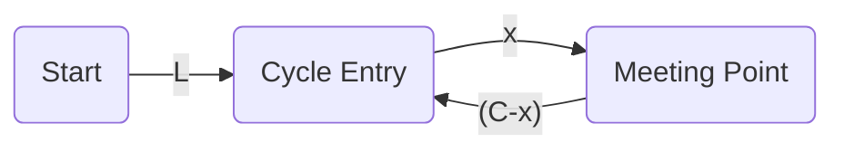

# Why Do the Pointers Meet at the Cycle Start? (Floyd’s Tortoise and Hare)

## The Setup

- **First phase:**  
  - Slow pointer moves 1 step at a time.
  - Fast pointer moves 2 steps at a time.
  - They meet somewhere inside the cycle.

- **Second phase:**  
  - One pointer is reset to the start.
  - Both pointers now move 1 step at a time.

## The Math Behind It

Let’s define:
- $L$: Distance from the start to the cycle entry.
- $C$: Length of the cycle.
- $x$: Distance from the cycle entry to the meeting point (along the cycle).

#### At the meeting point:
- Slow pointer has traveled $L + x$.
- Fast pointer has traveled $L + x + nC$ (for some integer $n$), since it may have looped around the cycle multiple times.

But since fast moves twice as fast:

$$
2(L + x) = L + x + nC \implies L + x = nC
$$
So:
$$
L = nC - x
$$
This means that if you start one pointer at the beginning and one at the meeting point, and both move at the same speed, after $L$ steps:
- The pointer from the start will be at the cycle entry.
- The pointer from the meeting point will also be at the cycle entry, because it will have moved $nC - x$ steps, which is exactly enough to complete the remaining part of the cycle and land at the entry.

## No Offset Problem

- The "offset" is exactly compensated by the number of steps each pointer takes.
- Both pointers will always meet at the cycle entry, regardless of where in the cycle they first met.

---

## Visualization

- After the meeting, one pointer starts at A, the other at C.
- Both move 1 step at a time.
- After $L$ steps, both are at B (cycle entry).

---

## Intuitive Explanation

- The pointer from the start is "catching up" to the cycle entry.
- The pointer from the meeting point is "wrapping around" the cycle, and the math ensures they sync up at the entry.

---

**Summary:**  
There is no risk of the pointers being "out of sync" or never meeting. The math of the cycle and the way the steps are counted guarantee they will always meet at the cycle entry, regardless of the initial offset. 